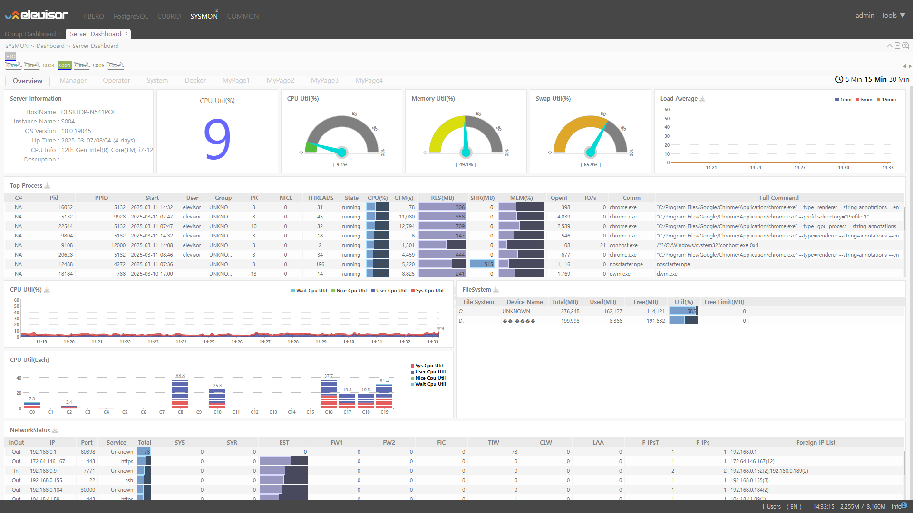
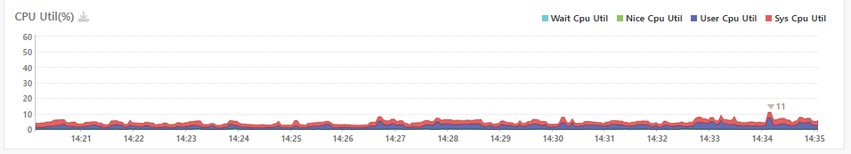

# image\_test

## 여긴 이미지 삽입 테스트 페이지 입니다.

### 1번 이미지

<figure><figcaption></figcaption></figure>

Fit

#### 1-1

<figure><figcaption></figcaption></figure>

Large

#### 1-2

<figure><figcaption></figcaption></figure>

Medium

<figure><figcaption></figcaption></figure>

Small

## other

<figure><figcaption></figcaption></figure>

<figure><figcaption></figcaption></figure>

